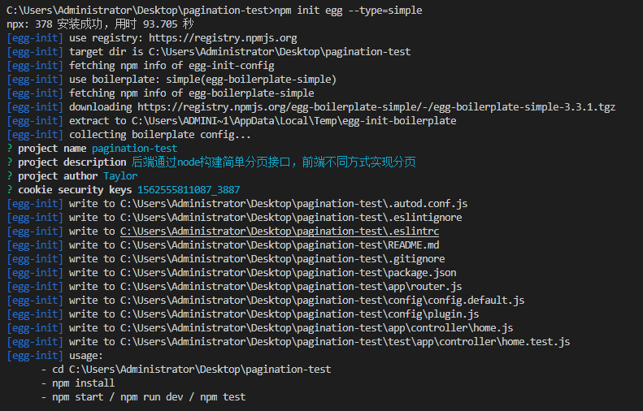
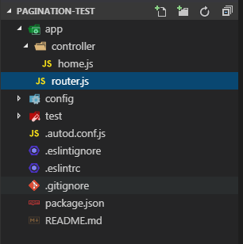
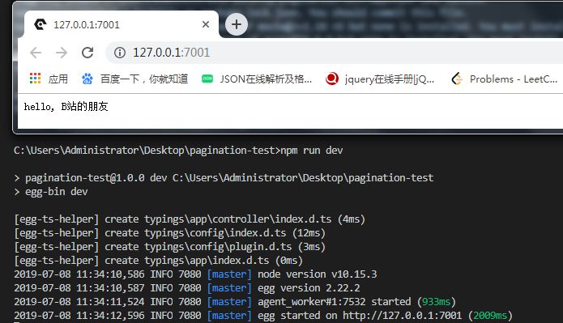
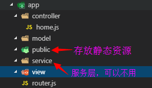
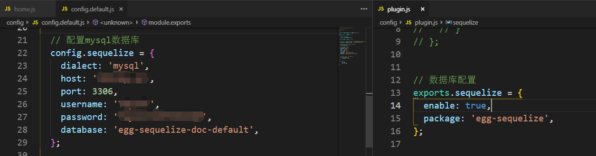
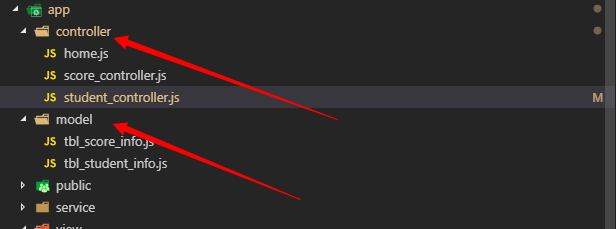
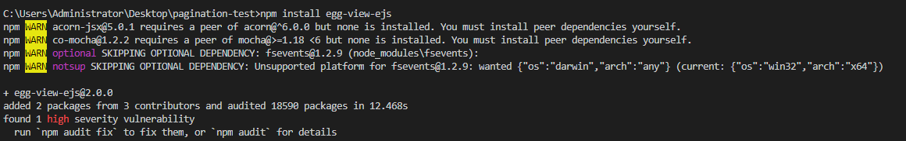
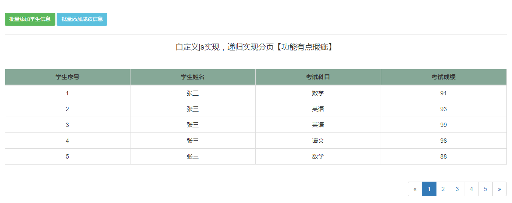
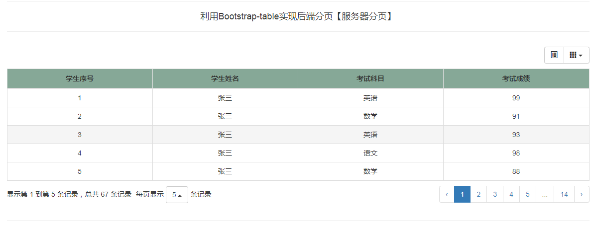
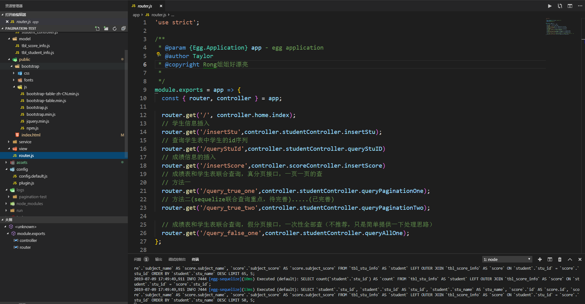

# 基于Node后台的分页测试【pagination-example】 

后端通过node构建简单分页接口，前端不同方式实现分页

## QuickStart

<!-- add docs here for user -->

see [egg docs][egg] for more detail.

### Development

```bash
$ npm i
$ npm run dev
$ open http://localhost:7001/public/index.html
```

### Deploy

```bash
$ npm start
$ npm stop
```

### npm scripts

- Use `npm run lint` to check code style.
- Use `npm test` to run unit test.
- Use `npm run autod` to auto detect dependencies upgrade, see [autod](https://www.npmjs.com/package/autod) for more detail.


[egg]: https://eggjs.org

# 项目文档总结

 1.新建项目文件夹pagination-test

```javascript
//采用cmd命令新建文件夹
mkdir pagination-test
//当然也可以直接通过鼠标右键新建pagination-test文件夹
```

2.进入pagination-test文件夹，初始化基本的egg结构

```javascript
// 为方便快速开发，使用阿里的egg框架，当然原生的也可以，常见的还有koa、express等；
// 切换目录，用cd指令
cd pagination-test
//进入到pagination-test目录中，构建基本egg项目结构(基本要求：已经安装npm或者cnpm)
npm init egg --type=simple
```

3.基本执行过程（这里是通过VS Code终端来执行cmd指令，原理一样）；



4.基本egg结构如下（只配置基本路由router）：



5.虽然项目项目后台接口比较简单，但是仍然采用MVC的模式

```javascript
//egg中仍然后MVC三层模式，即:controller、model、view(可以通过ejs等模板来渲染)
// egg中基本的路由配置，即：初始化配置
'use strict';

/**
 * @param {Egg.Application} app - egg application
 */
module.exports = app => {
  const { router, controller } = app;
  router.get('/', controller.home.index);
};
```

6.先启动默认效果，预览一下

```javascript
//可以通过指令启动egg服务，
      - cd C:\Users\Administrator\Desktop\pagination-test 
      - npm install 
      - npm start / npm run dev / npm test
//controller中的简单的接口实现
'use strict';

const Controller = require('egg').Controller;

class HomeController extends Controller {
  async index() {
    const { ctx } = this;
    // 接口相应
    ctx.body = 'hello, B站的朋友';
  }
}
module.exports = HomeController;
```



7.基本的egg开发结构已经构建，完成数据库表的字段的基本定义；

````mysql
/*
 Navicat MySQL Data Transfer

 Source Server         : 服务器
 Source Server Type    : MySQL
 Source Server Version : 50726
 Source Host           : XXXXXXXX
 Source Schema         : pagination_test

 Target Server Type    : MySQL
 Target Server Version : 50726
 File Encoding         : 65001

 Date: 08/07/2019 11:37:10
*/

SET NAMES utf8mb4;
SET FOREIGN_KEY_CHECKS = 0;

-- ----------------------------
-- Table structure for tbl_score_info 学生成绩表
-- ----------------------------
DROP TABLE IF EXISTS `tbl_score_info`;
CREATE TABLE `tbl_score_info`  (
  `id` bigint(20) NOT NULL COMMENT '成绩ID，主键',
  `subject_name` varchar(255) CHARACTER SET utf8 COLLATE utf8_general_ci NOT NULL COMMENT '学科名称',
  `subject_score` int(255) NOT NULL COMMENT '成绩得分',
  `stu_id` bigint(20) NOT NULL COMMENT '学生ID，tbl_stu_info表的外键',
  PRIMARY KEY (`id`) USING BTREE
) ENGINE = InnoDB CHARACTER SET = utf8 COLLATE = utf8_general_ci ROW_FORMAT = Dynamic;

-- ----------------------------
-- Table structure for tbl_stu_info  学生信息表
-- ----------------------------
DROP TABLE IF EXISTS `tbl_stu_info`;
CREATE TABLE `tbl_stu_info`  (
  `stu_id` bigint(20) NOT NULL COMMENT '学生ID',
  `stu_name` varchar(255) CHARACTER SET utf8 COLLATE utf8_general_ci NOT NULL COMMENT '学生姓名',
  PRIMARY KEY (`stu_id`) USING BTREE
) ENGINE = InnoDB CHARACTER SET = utf8 COLLATE = utf8_general_ci ROW_FORMAT = Dynamic;

SET FOREIGN_KEY_CHECKS = 1;
-- 预计在分页的时候会实现多表的联合查询（这里只演示两个表）
````

8.分别在app文件夹下面创建好model、controller、view、service(在MVC架构中，可以省略这层)文件夹，构建基础目录



9.利用egg中的sequelize模块来设置好基本的连接池参数和model层中的数据库表的模型，[sequelize API文档](https://eggjs.org/zh-cn/tutorials/sequelize.html)；

````javascript
// 安装sequelize模块
npm install --save egg-sequelize mysql2
//在 config/plugin.js 中引入 egg-sequelize 插件
exports.sequelize = {
  enable: true,
  package: 'egg-sequelize',
};
//在 config/config.default.js 中编写 sequelize 配置
config.sequelize = {
  dialect: 'mysql',
  host: '127.0.0.1', // 数据库地址
  port: 3306, // 端口号
  username:'Taylor', // 用户名
  password:'Taylor2237221210' // 密码
  database: 'egg-sequelize-doc-default',
};
````



10.演示的Demo中有tbl_score_info(成绩表)、tbl_stu_info(学生信息表)，对应着两个表的model，按照分层的思路，应该有着对应的controller和model（可以生路service的部分）



11.路由接口，定义controller中的基本查询，插入方法

```javascript
'use strict';

/**
 * @author Taylor
 * @copyright Rong姐姐好漂亮
 * 
 */
const Controller = require('egg').Controller;
// 学生表的控制器，学生信息接口的逻辑处理
class StudentController extends Controller {
  // 学生信息的插入
  async insertStu(){
      // 获取待插入的学生信息，利用get请求
     const stuName=this.ctx.query.student_name;
     console.log(stuName);
     
     // 获取当前时间的13位时间戳，用作学生表中的学生主键信息；
     const stuId=(new Date()).getTime();
     // 利用sequelize插入
     const student=await this.ctx.model.TblStudentInfo.create({
         stu_id:stuId,
         stu_name:stuName,
     });
     // 通过student的返回结果来判断是否插入成功
     if(student.stu_id != undefined){
         this.ctx.body={
             code:0,
             message:'学生信息插入成功',
             data:student
         }
     }else{
         //插入失败
         this.ctx.body={
            code:1,
            message:'学生信息插入失败',
            data:''
        }
     }
  }
  // 两表联合查询，方法一：自定义sql查询语句
  async queryPaginationOne(){
      //获取查询的起始位置，和一页显示的数据；
      let {offsetIndex,limitIndex} =this.ctx.query;
      // 处理参数
      if(!offsetIndex>0){
        offsetIndex=0
      }
      if(!limitIndex<30){
        limitIndex=30
      }
      //定义学生成绩信息的总记录数,左连接；
      const queryCountSql="SELECT count(tbl_stu_info.stu_id) as 'count' from tbl_stu_info LEFT JOIN tbl_score_info on tbl_stu_info.stu_id=tbl_score_info.stu_id ";
      // 定义分页查询的SQL
      const queryPaginationSql="SELECT tbl_stu_info.stu_id,tbl_stu_info.stu_name,tbl_score_info.subject_name,tbl_score_info.subject_score "+
                                "from tbl_stu_info LEFT JOIN tbl_score_info on tbl_stu_info.stu_id=tbl_score_info.stu_id order by tbl_stu_info.stu_name desc limit "+
                                offsetIndex + " , "+limitIndex;
      //获取两表联合起来的总记录数
      const countResult= await this.app.model.query(queryCountSql);
      //获取某一页展示的数据
      const result=await this.app.model.query(queryPaginationSql);
      console.log(countResult);
      console.log(result)      
      //判断结构
      if(countResult.length!=0&&result.length!=0){
          this.ctx.body={
              code:0,
              message:'自定义SQL查询的分页数据',
              data:{
                  total:countResult[0][0].count,
                  rows:result[0],
              }
          }
      }else{
        this.ctx.body={
            code:1,
            message:'无法通过自定义SQL查询分页数据',
            data:''
        }
      }
    }
  // 两表联合查询 方法二：用sequelize中提供的联合查询，已封装
  async queryPaginationTwo(){
    //获取查询的起始位置，和一页显示的数据；
    let {offsetIndex,limitIndex} =this.ctx.query;
    // 处理参数
    if(!offsetIndex>0){
        offsetIndex=0
    }
    if(!limitIndex<30){
        limitIndex=30
    }
    const score = this.ctx.model.TblScoreInfo;
    const student =this.ctx.model.TblStudentInfo;
    //查询问题，待完成；
    const result= await this.ctx.model.TblStudentInfo.findAndCountAll({
        order:[['stu_name','desc']],
        limit:30,
        offset:0,
        include:[{
            association:score.belongsTo(student,{
                foreignKey:'id',
                targetKey:'id'
            })
        }]
    });
    this.ctx.body=result
  }

  // 两表联合查询,查询全部，自定义sql查询语句
  async queryAllOne(){
    //定义学生成绩信息的总记录数,左连接；
    const queryCountSql="SELECT count(tbl_stu_info.stu_id) as 'count' from tbl_stu_info LEFT JOIN tbl_score_info on tbl_stu_info.stu_id=tbl_score_info.stu_id ";
    // 定义分页查询的SQL
    const queryPaginationSql="SELECT tbl_stu_info.stu_id,tbl_stu_info.stu_name,tbl_score_info.subject_name,tbl_score_info.subject_score "+
                              "from tbl_stu_info LEFT JOIN tbl_score_info on tbl_stu_info.stu_id=tbl_score_info.stu_id order by tbl_stu_info.stu_name desc "
    //获取两表联合起来的总记录数
    const countResult= await this.app.model.query(queryCountSql);
    //获取某一页展示的数据
    const result=await this.app.model.query(queryPaginationSql);
    console.log(countResult);
    console.log(result)      
    //判断结构
    if(countResult.length!=0&&result.length!=0){
        this.ctx.body={
            code:0,
            message:'自定义SQL查询的全部数据',
            data:{
                total:countResult[0][0].count,
                rows:result[0],
            }
        }
    }else{
      this.ctx.body={
          code:1,
          message:'无法通过自定义SQL查询全部数据',
          data:''
      }
    }
  }
}
module.exports = StudentController;

```

```json
//简单的查询结构，
{
    "code":0,
    "message":"自定义SQL查询的全部数据",
    "data":{
        "total":6,
        "rows":[
            {
                "stu_id":1562565758824,
                "stu_name":"张三",
                "subject_name":"英语",
                "subject_score":99
            },
            {
                "stu_id":1562565758824,
                "stu_name":"张三",
                "subject_name":"语文",
                "subject_score":98
            },
            {
                "stu_id":1562565758824,
                "stu_name":"张三",
                "subject_name":"数学",
                "subject_score":88
            },
            {
                "stu_id":1562565559665,
                "stu_name":"Bilibili",
                "subject_name":"英语",
                "subject_score":99
            },
            {
                "stu_id":1562565559665,
                "stu_name":"Bilibili",
                "subject_name":"数学",
                "subject_score":88
            },
            {
                "stu_id":1562565559665,
                "stu_name":"Bilibili",
                "subject_name":"语文",
                "subject_score":98
            }
        ]
    }
}
```

**特别说明**

为了同时演示自定义分页和利用Bootstrap-table控件分页，我将接口data部分的返回json数据格式同时约束如下（即：Bootstrap-table控件要求的格式）：

```javascript
// 为了适配boostrap-table的后台分页，所以分页的格式定义为如下：
{
    rows:data, //存放的是后台返回的数据

    total:total //存放的是总的数据条数

}
```

13.配置egg-view-ejs模板渲染，实现接口路由的时候，能够渲染view视图中的模板

```javascript
// cmd 安装命令
npm install egg-view-ejs
// 在config/plugin.js中配置
exports.ejs={
    enable:true,
    package:'egg-view-ejs'
}
// 在config/config.default.js中配置
config.view={
    mapping:{
        //配置模板引擎的后缀html
        '.hmtl':'ejs'
    }
}
```



12.前端页面采用Bootstrap的简单样式，展示不同的分页效果

```html
<!DOCTYPE html>
<html lang="en">

<head>
    <meta charset="UTF-8">
    <meta name="viewport" content="width=device-width, initial-scale=1.0">
    <meta http-equiv="X-UA-Compatible" content="ie=edge">
    <title>分页展示</title>
    <link href="bootstrap/css/bootstrap.min.css" rel="stylesheet">
    <!-- bootstrap-table控件css样式 -->
    <link rel="stylesheet" href="bootstrap/css/bootstrap-table.min.css">
    <style>
        /* 添加分页表头颜色 */
        thead{
            background: #86a897
        }
    </style>
</head>

<body>
    <div class="container">
        <div class="row" style="margin-top: 40px;">
            <!--定义表格  -->
            <button class="btn btn-sm btn-success" id="addStu">批量添加学生信息</button>
            <button class="btn btn-sm btn-info" id="addScore">批量添加成绩信息</button>
            <hr>
            <h4 class="text-center">自定义js实现，递归实现分页【功能有点瑕疵】</h4>
            <hr>
            <table class="table table-bordered text-center table-hover" id="my_table">
                <!-- <thead style="background: #86a897">
                    <th class="text-center">学生序号</th>
                    <th class="text-center">学生姓名</th>
                    <th class="text-center">考试科目</th>
                    <th class="text-center">考试成绩</th>
                </thead>
                <tr>
                    <td>21</td>
                    <td>1212</td>
                    <td>121</td>
                    <td>1211</td>
                </tr> -->
            </table>
            <div class="text-right" id="page">
                <!-- <nav aria-label="Page navigation">
                    <ul class="pagination">
                        <li>
                            <a href="#" aria-label="Previous">
                                <span aria-hidden="true">&laquo;</span>
                            </a>
                        </li>
                        <li><a href="#">1</a></li>
                        <li><a href="#">2</a></li>
                        <li><a href="#">3</a></li>
                        <li><a href="#">4</a></li>
                        <li><a href="#">5</a></li>
                        <li>
                            <a href="#" aria-label="Next">
                                <span aria-hidden="true">&raquo;</span>
                            </a>
                        </li>
                    </ul>
                </nav> -->
            </div>
            <hr>
            <h4 class="text-center">利用Bootstrap-table实现后端分页【服务器分页】</h4>
            <hr>
            <table id="bootstrap_table_after"></table>
            <hr>
            <h4 class="text-center">利用Bootstrap-table实现前端分页【数据量大时不推荐】</h4>
            <hr>
            <table id="bootstrap_table_front"></table>
            <!-- 个人信息显示 -->
            <div class="text-center" style="margin-top: 20px">
                <p>版权所有@2019.7 
                    <a href="https://space.bilibili.com/350937042">Rong姐姐好可爱</a>
                </p>
            </div>
        </div>
    </div>
</body>
<!-- 引入jquery -->
<script src="bootstrap/js/jquery.min.js"></script>
<!-- 引入bootstrap的js文件 -->
<script src="bootstrap/js/bootstrap.min.js"></script>
<!-- Latest compiled and minified JavaScript -->
<script src="bootstrap/js/bootstrap-table.min.js"></script>
<!-- Latest compiled and minified Locales -->
<script src="bootstrap/js/bootstrap-table-zh-CN.min.js"></script>
<script>
<html>
```



13.完成自定义sql分页接口，处理好接口数据格式，并且测试接口数据；

```javascript
// 两表联合查询，方法一：自定义sql查询语句
    async queryPaginationOne() {
        //获取查询的起始位置，和一页显示的数据；
        let {
            offsetIndex,
            limitIndex
        } = this.ctx.query;
        // 处理参数
        if (offsetIndex < 0) {
            offsetIndex = 0
        }
        //定义学生成绩信息的总记录数,左连接；
        const queryCountSql = "SELECT count(tbl_stu_info.stu_id) as 'count' from tbl_stu_info LEFT JOIN tbl_score_info on tbl_stu_info.stu_id=tbl_score_info.stu_id ";
        // 定义分页查询的SQL
        const queryPaginationSql = "SELECT tbl_stu_info.stu_id,tbl_stu_info.stu_name,tbl_score_info.subject_name,tbl_score_info.subject_score " +
            "from tbl_stu_info LEFT JOIN tbl_score_info on tbl_stu_info.stu_id=tbl_score_info.stu_id order by tbl_stu_info.stu_name desc limit " +
            offsetIndex + " , " + limitIndex;
        //获取两表联合起来的总记录数
        const countResult = await this.app.model.query(queryCountSql);
        //获取某一页展示的数据
        const result = await this.app.model.query(queryPaginationSql);
        console.log(countResult);
        console.log(result)
        //判断结构
        if (countResult.length != 0 && result.length != 0) {
            this.ctx.body = {
                code: 0,
                message: '自定义SQL查询的分页数据',
                data: {
                    total: countResult[0][0].count,
                    rows: result[0],
                }
            }
        } else {
            this.ctx.body = {
                code: 1,
                message: '无法通过自定义SQL查询分页数据',
                data: ''
            }
        }
    }
```

**前端自定义js分页函数封装**

```javascript
    //抽离成分页方法
    function paginationMethod(currentPage, limit) {
        //处理当前页
        //获取成绩分页信息
        $.get("/query_true_one", {
            offsetIndex: (currentPage-1)*limit,
            limitIndex: limit
        }, function (result) {
            console.log(result);
            if (result.code == 0) {
                //存在输入
                let tableHtml =
                    '<thead style="background: #86a897"><th class="text-center">学生序号</th><th class="text-center">学生姓名</th><th class="text-center">考试科目</th><th class="text-center">考试成绩</th></thead>';
                // 获取当前页查询到的数据
                const pageSize = result.data.rows.length;
                //通过循环来追加html
                for (var i = 0; i < pageSize; i++) {
                    tableHtml += '<tr><td>' + (i + 1) + '</td><td>' + result.data.rows[i].stu_name + '</td><td>' +
                        result.data.rows[i].subject_name + '</td><td>' + result.data.rows[i].subject_score +
                        '</td></tr>'
                }
                //循环完成
                tableHtml += '</table>'
                console.log(tableHtml)
                //追加到表中
                $('#my_table').html(tableHtml);
                //通过循环注入分页
                let paginationHtml = '<nav aria-label="Page navigation"><ul class="pagination">'
                // 获取总的数据量
                const allCount = result.data.total;
                //总共分页的数目
                const pageCount = allCount % limit == 0 ? allCount / limit : Math.ceil(allCount /limit);
                console.log(pageCount)
                //定义当前页面
                //var currentPage = 1;
                // 当前页需要小于总页数,防止越界查询
                currentPage = currentPage <= pageCount ? currentPage : 1;

                if (pageCount == 1) {
                    paginationHtml += '<li class="active"><a href="javascript:paginationMethod(1,'+limit+')">' + 1 + '</a></li>';
                } else if (pageCount < 5) {
                    paginationHtml +=
                        '<li id="pre"><a href="javascript:paginationMethod('+(currentPage-1)+','+limit+')" aria-label="Previous"><span aria-hidden="true">&laquo;</span>' +
                        '</a></li>'
                    //少于5也
                    for (var i = 0; i < pageCount; i++) {
                        if (currentPage == (i + 1)) {
                            //高亮显示
                            paginationHtml += '<li class="active"><a href="javascript:paginationMethod('+(i+1)+','+limit+')">' + (i + 1) + '</a></li>';
                        } else {
                            //
                            paginationHtml += '<li><a href="javascript:paginationMethod('+(i+1)+','+limit+')">' + (i + 1) + '</a></li>';
                        }
                    }
                    paginationHtml +=
                        '<li id="next"><a href="javascript:paginationMethod('+(currentPage+1)+','+limit+')" aria-label="Next"><span aria-hidden="true">&raquo;</span>' +
                        '</a></li>'
                } else {
                    //总页数大于5页,即显示5页;
                    paginationHtml +=
                        '<li id="pre"><a href="javascript:paginationMethod('+(currentPage-1)+','+limit+')" aria-label="Previous"><span aria-hidden="true">&laquo;</span>' +
                        '</a></li>'
                    if (currentPage < 5) {
                        for (var i = 0; i < 5; i++) {
                            if (currentPage == (i + 1)) {
                                //高亮显示
                                paginationHtml += '<li class="active"><a href="javascript:paginationMethod('+(i+1)+','+limit+')">' + (i + 1) + '</a></li>';
                            } else {
                                //
                                paginationHtml += '<li><a href="javascript:paginationMethod('+(i+1)+','+limit+')">' + (i + 1) + '</a></li>';
                            }
                        }
                    } else if (currentPage < (pageCount - 4)&&currentPage>=5) {
                        //在中间显示5条
                        //随机生成1-5的整数
                        const randomInt = Math.floor(Math.random() * (1 - 5) + 5);
                        //写个5次循环
                        for (var i = currentPage - randomInt; i < (currentPage - randomInt) + 5; i++) {
                            if (currentPage == i) {
                                //高亮显示
                                paginationHtml += '<li class="active"><a href="javascript:paginationMethod('+(i)+','+limit+')">' + (i) + '</a></li>';
                            } else {
                                //
                                paginationHtml += '<li><a href="javascript:paginationMethod('+(i)+','+limit+')">' + (i) + '</a></li>';
                            }
                        }
                    } else {
                        //currentPage在最后5页的范畴里
                        for (var i = pageCount - 4; i <= pageCount; i++) {
                            if (currentPage == i) {
                                //高亮显示
                                paginationHtml += '<li class="active"><a href="javascript:paginationMethod('+(i)+','+limit+')">' + i + '</a></li>';
                            } else {
                                //
                                paginationHtml += '<li><a href="javascript:paginationMethod('+(i)+','+limit+')">' + i + '</a></li>';
                            }
                        }
                    }
                    //添加尾页
                    paginationHtml +=
                        '<li id="next"><a href="javascript:paginationMethod('+(currentPage+1)+','+limit+')" aria-label="Next"><span aria-hidden="true">&raquo;</span>' +
                        '</a></li>'
                }

                //添加 标签结束标记
                paginationHtml += ' </ul></nav>'
                //将分页的html添加到div中
                $('#page').html(paginationHtml)
                //在首页的 时候,限制上一页点击
                if (currentPage == 1) {
                    $('#pre').addClass('disabled')
                } else {
                    $('#pre').removeClass('disabled')
                }
                //当在尾页的时候,限制下一页点击
                if (currentPage == pageCount) {
                    $('#next').addClass('disabled')
                } else {
                    $('#next').removeClass('disabled')
                }
            }
        })
    }
```

14.利用Egg-sequelize模块来实现联表查询，提供分页接口，优化查询速度

```javascript
// 两表联合查询 方法二：用sequelize中提供的联合查询，已封装
    async queryPaginationTwo() {
        //获取查询的起始位置，和一页显示的数据；
        let {
            offsetIndex,
            limitIndex
        } = this.ctx.query;
        // 处理参数
        offsetIndex = parseInt(offsetIndex) || 1;
        limitIndex = parseInt(limitIndex) || 5;

        //查询问题，待完成;(已解决)
        //association:this.ctx.model.TblScoreInfo.belongsTo(this.ctx.model.TblScoreInfo
        // 应该是student表调用findAndCountAll()方法，与score表连接，所以，在belongsTo()中，应该处理好score model的主外键关联

        const result = await this.ctx.model.TblStudentInfo.findAndCountAll({
            order: [
                ['stu_name', 'desc']
            ],
            limit: limitIndex,
            offset: offsetIndex,
            include: [{
                association: this.ctx.model.TblScoreInfo.belongsTo(this.ctx.model.TblScoreInfo, {
                    foreignKey: 'stu_id',
                    targetKey: 'stu_id'
                }),
                // 设置结果列字段
                attributes: [
                    ['subject_name', 'subject_name'],
                    ['subject_score', 'subject_score'],
                ]
            }],
            // 设置结果列字段
            attributes: [
                ['stu_id', 'stu_id'],
                ['stu_name', 'stu_name'],
            ]
        });
        if (result != undefined) {
            //查询成功
            this.ctx.body = {
                code: 0,
                message: 'sequelize联表查询分页数据',
                data: {
                    total: result.count,
                    rows: result.rows
                }
            }
        } else {
            //查询失败
            this.ctx.body = {
                code: 1,
                message: 'sequelize联表查询分页数据出错',
                data: ''
            }
        }

    }
```

**同时前端采用Bootstrap-table来实现后端分页**



**Bootstrap-table初始化脚本**

```javascript
$("#bootstrap_table_after").bootstrapTable({
        url: '../query_true_two',
        method: 'get',
        striped: true,//设置为 true 会有隔行变色效果
        undefinedText: "空",//当数据为 undefined 时显示的字符
        pagination: true, //分页
        paginationLoop:true,//设置为 true 启用分页条无限循环的功能。
        showToggle: "true",//是否显示 切换试图（table/card）按钮
        showColumns: "true",//是否显示 内容列下拉框
        pageNumber: 1,//如果设置了分页，首页页码
        // showPaginationSwitch:true,//是否显示 数据条数选择框
        pageSize: 5,//如果设置了分页，页面数据条数
        pageList: [5, 10, 20, 40],	//如果设置了分页，设置可供选择的页面数据条数。设置为All 则显示所有记录。
        paginationPreText: '‹',//指定分页条中上一页按钮的图标或文字,这里是<
        paginationNextText: '›',//指定分页条中下一页按钮的图标或文字,这里是>
        // singleSelect: false,//设置True 将禁止多选
        search: false, //显示搜索框
        data_local: "zh-US",//表格汉化
        sidePagination: "server", //服务端处理分页
        queryParams: function (params) {//自定义参数，这里的参数是传给后台的，我这是是分页用的
            return {//这里的params是table提供的
                offsetIndex: params.offset,//从数据库第几条记录开始
                limitIndex:  params.limit//找多少条
            };
        },
        // 当借口数据与Bootstrap-table数据格式不一样的时候，可以调用responseHandler() 回调方法格式化数据
        responseHandler: function(res) {
            console.log(res)
            return {
                "total": res.data.total,//总页数
                "rows": res.data.rows   //数据
            };
        },
        idField: "userId",//指定主键列
        columns: [
            {
                title: '学生序号',//表的列名
                field: 'stu_id',//json数据中rows数组中的属性名
                align: 'center',//水平居中
                formatter:function(value,row,index){
                    return index+1;
                }
            },
            {
                title: '学生姓名',
                field: 'stu_name',
                align: 'center'
            },
            {
                title: '考试科目',
                field: 'score.subject_name',
                align: 'center'
            },
            {
                title: '考试成绩',
                field: 'score.subject_score',
                align: 'center'
            }]
    });
```

15.同样利用sequelize，实现联表查询，一次性查询所有的数据（不推荐），大数据量下前端分页的弊端

```javascript
 // 两表联合查询,查询全部，自定义sql查询语句(可用于Bootstrap-table前端分页)
    async queryAllOne() {
        // 直接关联表来查询
        const result = await this.ctx.model.TblStudentInfo.findAndCountAll({
            order: [
                ['stu_name', 'desc']
            ],
            // 查询所有
            //  limit:-1,
            //  offset:1,
            include: [{
                association: this.ctx.model.TblScoreInfo.belongsTo(this.ctx.model.TblScoreInfo, {
                    foreignKey: 'stu_id',
                    targetKey: 'stu_id',
                }),
                // 设置结果列字段
                attributes: [
                    ['subject_name', 'subject_name'],
                    ['subject_score', 'subject_score'],
                ]
            }],
            // 设置结果列字段
            attributes: [
                ['stu_id', 'stu_id'],
                ['stu_name', 'stu_name'],
            ]
        });
        //判断结果
        if (result != undefined) {
            this.ctx.body = {
                code: 0,
                message: '自定义SQL查询的全部数据',
                data: {
                    total: result.count,
                    rows: result.rows
                }
            }
        } else {
            this.ctx.body = {
                code: 1,
                message: '无法通过自定义SQL查询全部数据',
                data: ''
            }
        }
    }
```

**前端分页Bootstrap-table的初始化（跟后端分页差不多）**

```javascript
//Bootstrap-table前端分页初始化（即：一次性查询出搜索的数据）；
    $("#bootstrap_table_front").bootstrapTable({
        url: '../query_false_one',
        method: 'get',
        striped: true,//设置为 true 会有隔行变色效果
        undefinedText: "空",//当数据为 undefined 时显示的字符
        pagination: true, //分页
        paginationLoop:true,//设置为 true 启用分页条无限循环的功能。
        showToggle: "true",//是否显示 切换试图（table/card）按钮
        showColumns: "true",//是否显示 内容列下拉框
        pageNumber: 1,//如果设置了分页，首页页码
        // showPaginationSwitch:true,//是否显示 数据条数选择框
        pageSize: 5,//如果设置了分页，页面数据条数
        pageList: [5, 10, 20, 30],	//如果设置了分页，设置可供选择的页面数据条数。设置为All 则显示所有记录。
        paginationPreText: '‹',//指定分页条中上一页按钮的图标或文字,这里是<
        paginationNextText: '›',//指定分页条中下一页按钮的图标或文字,这里是>
        // singleSelect: false,//设置True 将禁止多选
        search: false, //显示搜索框
        data_local: "zh-US",//表格汉化
        sidePagination: "client", //客户端处理分页
        // 一次性查询出所有，不需要传参
        // queryParams: function (params) {//自定义参数，这里的参数是传给后台的，我这是是分页用的
        //     return {//这里的params是table提供的
        //         offsetIndex: params.offset,//从数据库第几条记录开始
        //         limitIndex:  params.limit//找多少条
        //     };
        // },
        // 当借口数据与Bootstrap-table数据格式不一样的时候，可以调用responseHandler() 回调方法格式化数据
        responseHandler: function(res) {
            console.log(res)
            return {
                "total": res.data.total,//总页数
                "rows": res.data.rows   //数据
            };
        },
        columns: [
            {
                title: '学生序号',//表的列名
                field: 'stu_id',//json数据中rows数组中的属性名
                align: 'center',//水平居中
                formatter:function(value,row,index){
                    return index+1;
                }
            },
            {
                title: '学生姓名',
                field: 'stu_name',
                align: 'center'
            },
            {
                title: '考试科目',
                field: 'score.subject_name',
                align: 'center'
            },
            {
                title: '考试成绩',
                field: 'score.subject_score',
                align: 'center'
            }]
    });
```

**使用bootstrap-table总结**

1. 由于Bootstrap-table是封装好的js脚本，所有在利用其进行分页的时候，必然会对后台接口的数据格式有要求；当遇到项目中统一了接口要求，但却不符合Bootstrap-table的接口要求规范的时候，bootstrap-table提供了结构格式方法；

   ```javascript
   // 当接口数据与Bootstrap-table数据格式不一样的时候，可以调用responseHandler() 回调方法格式化数据
   responseHandler: function(res) {
       // 自己后台接口数据，res
       console.log(res) 
       // 格式化
       return {
           "total": res.data.total,//总页数
           "rows": res.data.rows   //数据
       };
   },
   ```

2. 在服务端进行分页的时候，需要动态的改变查询的变量offset和limit,也是通过回调函数的方式；

   ```javascript
   // Bootstrap-table初始化配置
   queryParams: function (params) {//自定义参数，这里的参数是传给后台的，我这是是分页用的
       return {//这里的params是table提供的
           offsetIndex: params.offset,//从数据库第几条记录开始
           limitIndex:  params.limit//找多少条
       };
   },
   ```

3. 常用后端分页Bootstrap-table设置

   ```javascript
   $("#bootstrap_table_after").bootstrapTable({
       url: '../query_true_two',
       method: 'get',
       striped: true,//设置为 true 会有隔行变色效果
       undefinedText: "空",//当数据为 undefined 时显示的字符
       pagination: true, //分页
       paginationLoop:true,//设置为 true 启用分页条无限循环的功能。
       showToggle: "true",//是否显示 切换试图（table/card）按钮
       showColumns: "true",//是否显示 内容列下拉框
       pageNumber: 1,//如果设置了分页，首页页码
       // showPaginationSwitch:true,//是否显示 数据条数选择框
       pageSize: 5,//如果设置了分页，页面数据条数
       pageList: [5, 10, 20, 40],	//如果设置了分页，设置可供选择的页面数据条数。设置为All 则显示所有记录。
       paginationPreText: '‹',//指定分页条中上一页按钮的图标或文字,这里是<
       paginationNextText: '›',//指定分页条中下一页按钮的图标或文字,这里是>
       // singleSelect: false,//设置True 将禁止多选
       search: false, //显示搜索框
       data_local: "zh-US",//表格汉化
       sidePagination: "server", //服务端处理分页
       queryParams: function (params) {//自定义参数，这里的参数是传给后台的，我这是是分页用的
           return {//这里的params是table提供的
               offsetIndex: params.offset,//从数据库第几条记录开始
               limitIndex:  params.limit//找多少条
           };
       },
       // 当借口数据与Bootstrap-table数据格式不一样的时候，可以调用responseHandler() 回调方法格式化数据
       responseHandler: function(res) {
           console.log(res)
           return {
               "total": res.data.total,//总页数
               "rows": res.data.rows   //数据
           };
       },
       idField: "userId",//指定主键列
       columns: [
           //表格数据
       });
   ```

   16.完成学生信息添加接口，可以用来添加大量数据，模拟分页性能；

   ```javascript
   async insertStu() {
       // 获取待插入的学生信息，利用get请求
       const stuName = this.ctx.query.student_name;
       console.log(stuName);
   
       // 获取当前时间的13位时间戳，用作学生表中的学生主键信息；
       const stuId = (new Date()).getTime();
       // 利用sequelize插入
       const student = await this.ctx.model.TblStudentInfo.create({
           stu_id: stuId,
           stu_name: stuName,
       });
       // 通过student的返回结果来判断是否插入成功
       if (student.stu_id != undefined) {
           this.ctx.body = {
               code: 0,
               message: '学生信息插入成功',
               data: student
           }
       } else {
           //插入失败
           this.ctx.body = {
               code: 1,
               message: '学生信息插入失败',
               data: ''
           }
       }
   }
   ```

   同时，前端演示界面提供“批量添加学生信息按钮”，并监听，采用异步的方式以延迟200ms的方式批量添加学还是学生信息，确保信息不重复；

   ```javascript
   //添加学生信息按钮监听
   $("#addStu").click(function () {
       //利用循环添加，每次添加10个学生用户，模拟数据
       for (var i = 0; i < 10; i++) {  
           //随机生成1-100的随机数
           const preNum=Math.floor(Math.random()*(1 - 100) + 100)
           const nextNum=Math.floor(Math.random()*(1 - 100) + 100)
           //随机生成学生名字
           let stuName=preNum+'---Bilibili---'+nextNum
           //每隔200ms向后台请求一次，避免出现并发错误
           setTimeout(() => {
               //向后台请求
               $.get("/insertStu", {
                   student_name:stuName
               }, function (data) {
                   console.log(data);
               })
           }, 200);
       }
   });
   ```

   17.根据学生信息的主键ID，在成绩表中添加成绩信息，保证成绩表和学生表信息的主外键约束，方便分页的时候联表查询；

   ```javascript
   // 成绩信息的插入
   async insertScore(){
       // 获取待插入的成绩信息，利用get请求
       const {subjectName,subjectScore,stuId}=this.ctx.query;
       // 获取当前时间的13位时间戳，用作成绩表中的成绩主键信息；
       const id=(new Date()).getTime();
       // 利用sequelize插入
       //另外一种方式：采用捕获异常的方式来判断是否插入成功，
       try {
           const score=await this.ctx.model.TblScoreInfo.create({
               id:id,
               subject_name:subjectName,
               subject_score:subjectScore,
               stu_id:stuId
           });
   
           // 通过student的返回结果来判断是否插入成功
           if(student.stu_id != undefined){
               this.ctx.body={
                   code:0,
                   message:'学生信息插入成功',
                   data:student
               }
           }else{
               //插入失败
               this.ctx.body={
                   code:1,
                   message:'学生信息插入失败',
                   data:''
               }
           }
       } catch (error) {
           //如果出现插入异常，也会导致插入失败，即捕获抛出信息
           //插入失败
           this.ctx.body={
               code:1,
               message:'学生信息插入失败',
               data:error
           }
       }
   }
   ```

   同时，在页面上也添加“批量添加成绩信息”的按钮，完成对按钮的监听，保证对成绩信息与学生信息的关联，方便后面测试分页；

   ```javascript
   //添加批量写入成绩信息的按钮监听；
   $('#addScore').click(function(){
       //先从接口获取学生表中学生的id主键，这是为了在添加成绩信息的时候，可以和成绩对上，即：学生表中的学生id主键是成绩表的外键约束；
       $.get('/queryStuId',function(result){
           console.log(result)
           //针对每个学生id，模拟添加语文、数学、英语三门成绩
           const studentNum=result.data.length;
           for(var i=0;i<studentNum;i++){
               //对每个学生，循环三次添加，三门成绩
               for(var j=0;j<3;j++){
                   // 随机生成一个成绩 80~99
                   const randomScore=Math.floor(Math.random()*(80-99)+99)
                   let subjectName;
                   if(j==0){
                       subjectName='语文';
                   }
                   if(j==1){
                       subjectName='数学';
                   }
                   if(j==2){
                       subjectName='英语';
                   }
                   //当前学生的id
                   const stuId=result.data[i].stu_id;
                   //每隔200ms向后台请求一次
                   setTimeout(() => {
                       //向后台请求插入
                       $.get('/insertScore',{
                           //参数
                           subjectName:subjectName,
                           subjectScore:randomScore,
                           //学号
                           stuId:stuId
                       },function(backResult){
                           console.log("成绩添加结果：");
                           console.log(backResult);
                       }) 
                   }, 200);
               }
           }
       })
   });
   ```

   18.整理前后端代码，尽量的将重复的代码抽离出方法，递归调用；同时测试比较三种分页的效果，完成项目，项目的接口路由如下：

   

   **最后总结：**

   ​		分页是平时开发中常用的，虽然自定义js能够实现基本的分页，但是终究没有封装好的框架控件来的快速和舒适；这里将自己平时对分页的基本实现总结下来，方便日后学习和使用，希望对自己，对他人都有帮助；
